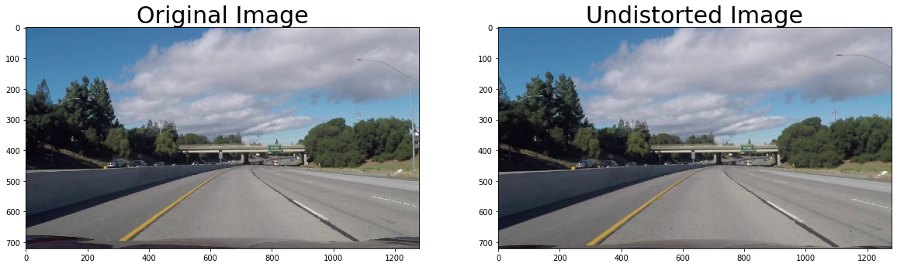
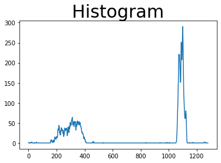
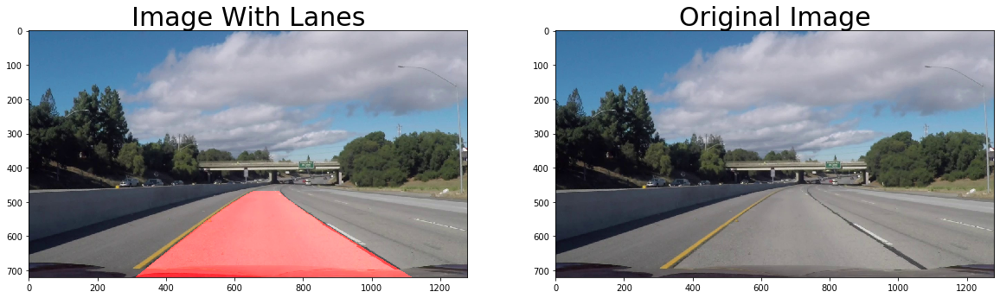

# **Finding Lane Lines on the Road** 

---

**Finding Lane Lines on the Road**

In this project, my goal was to write a software pipeline to identify the lane boundaries in a video

---

### The project

### 1. The pipeline. 

I approached the problem in a systematic way, creating a pipeline divided in different steps and that is easy to follow:

 **Camera calibration:** 

Created a camera calibration function to calibrate the camera and get the distortion coefficients using the chessboard images located in the camera_cal directory. I did not use the pickle file to store the coefficients, I stored the values in memory.

```
	def calibrate_camera(images):
		# Prepare object points 0,0,0 ... 8,5,0
	    obj_pts = np.zeros((6*9,3), np.float32)
	    obj_pts[:,:2] = np.mgrid[0:9, 0:6].T.reshape(-1,2)
	    ...
```


**Applied a distortion correction to raw images**

Created function to correct the raw images. This function accept an image and the coefficients returned by the camera calibration function.

```
def undistort_image(img, mtx, dist):
    undist_img = cv2.undistort(img, mtx, dist, None, mtx)
    return undist_img 
```



**Use color transforms, gradients, etc., to create a thresholded binary image**
This is achieved by the function called process_image:

```
def process_image(img, mtx, dist, s_thresh=(170, 255), sx_thresh=(20, 100)):
    img = undistort_image(img, mtx, dist)
    img = np.copy(img)
    
    # Convert RGB to HLS color space 
    hls = cv2.cvtColor(img, cv2.COLOR_RGB2HLS)
    l_channel = hls[:,:,1]
    s_channel = hls[:,:,2]
    ...
```


**Apply a perspective transform to rectify binary image ("birds-eye view")**

```
def perspective_warp(img, 
                     dst_size=(1280,720),
                     src=np.float32([(0.43,0.65),(0.58,0.65),(0.1,1),(1,1)]),
                     dst=np.float32([(0,0), (1, 0), (0,1), (1,1)])):
    img_size = np.float32([(img.shape[1],img.shape[0])])
    src = src * img_size
```


**Detect lane pixels and fit to find the lane boundary**

I'm using the sliding window method. 

```
def find_lane_pixels(img, nwindows=9, margin=100, minpix = 50, draw_windows=True):
    global left_a, left_b, left_c, right_a, right_b, right_c 
    left_fit_= np.empty(3)
    right_fit_ = np.empty(3)
    out_img = np.dstack((img, img, img))*255
    ...
```

This method call the get_histogram function

```
def get_histogram(img):
    histogram = np.sum(img[img.shape[0]//2:,:], axis=0)
    return histogram
```



This is the result from calling the `find_lane_pixels` method for the current image.


**Curvature of the lane and vehicle position with respect to center**
To get the lane's curvature I called the `get_curvature` function
 
```
def get_curvature(img, leftx, rightx):
    ploty = np.linspace(0, img.shape[0]-1, img.shape[0])
    y_eval = np.max(ploty)
    ym_per_pix = 30.5/720 # meters per pixel in y dimension
    xm_per_pix = 3.7/720 # meters per pixel in x dimension
    ...
```

**Warp the detected lane boundaries back onto the original image**

To get the image back to the original state I call the function below

```
def inverse_perspective_warp(img, 
                     dst_size=(1280,720),
                     src=np.float32([(0,0), (1, 0), (0,1), (1,1)]),
                     dst=np.float32([(0.43,0.65),(0.58,0.65),(0.1,1),(1,1)])):
    img_size = np.float32([(img.shape[1],img.shape[0])])
    src = src* img_size
    ...
```

**Output visual display of the lane boundaries and numerical estimation of lane curvature and vehicle position**

To draw the line I created a function called `draw_lines`.

```
def draw_lanes(img, left_fit, right_fit, color):
    plot_lane = np.linspace(0, img.shape[0]-1, img.shape[0])
    color_img = np.zeros_like(img)
    ...
```




### 2. Potential shortcomings in the current pipeline


One potential shortcoming would be incorrect image calculation and display when the lanes are not marked properly or there is a difference in the road's color due to repairs or road deterioration.


### 3. Possible improvements to the pipeline

A possible improvement would be to find a way to draw a line when the data is missing.

Another potential improvement could be to deal with curves and different lighting conditions.