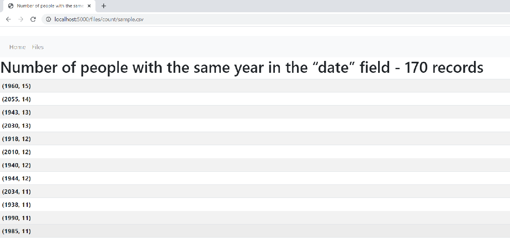
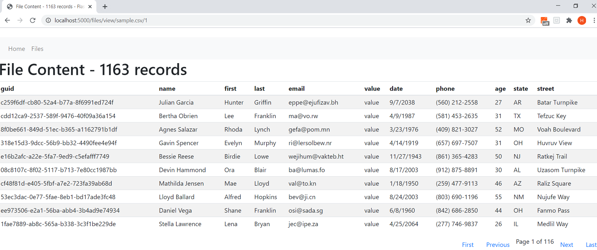
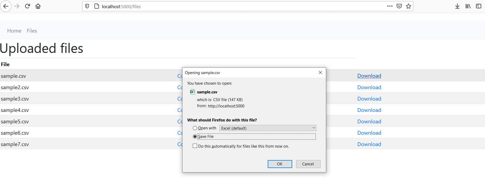

# **Flask Server** 

---

**Flask Server**

In this project my goal was to write a small web server that will alow the user to upload, download and view csv files from a web interface.

---
### Dependencies
The only special libraries used in this project are:
	• Flask
	• Flask-Bootstrap
	• Pandas

### To run the project
For Linux:
	export FLASK_APP=server.py
	flask run

For Windows:
	set FLASK_APP=server.py
	flask run

### Limits
	The maximum file size is 10 megabytes. If a larger file is transmitted, Flask will raise a RequestEntityTooLarge exception.

	When using the local development server, you may get a connection reset error instead of a 413 response. You will get the correct status response when running the app with a production WSGI server.

---
### Requirements

The application should have the ability to:
    • Upload a CSV file
    • List uploaded CSV files
    • Download the previously uploaded CSV file
    • Display the CSV content showing at least all column headers and content
    • Provide statistics on the number of people with the same year in the “date” field.

#### Uploading files

#### File list

### Number of people with the same year in the “date” field

#### View file content

#### Download file

