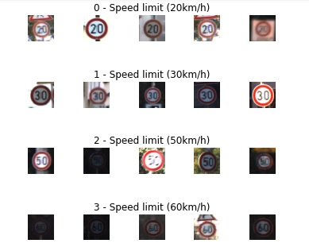
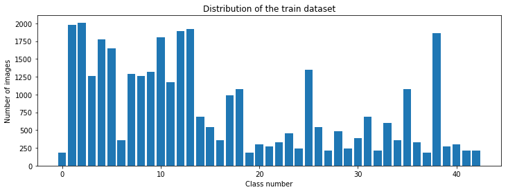
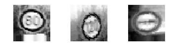
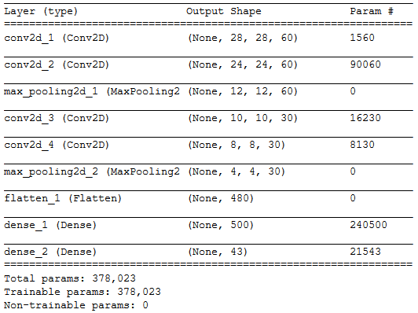
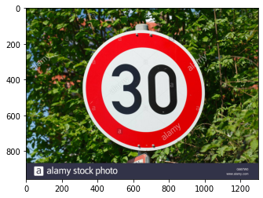
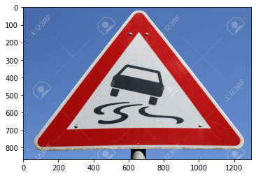
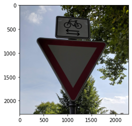
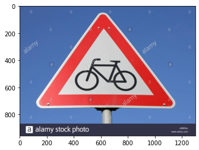

# **Traffic Sign Recognition** 

---
The goal of this project is to train a CNN to recognize traffic signs from the German data set. This data set contains 43 different signs.

This project project is divided in the follow steps:

* Load the data set 
* Explore, summarize and visualize the data set
* Design, train and test a model architecture
* Use the model to make predictions on new images
* Analyze the softmax probabilities of the new images

### Data Set Summary & Exploration

#### 1. Data set summary 

I used the pandas library to load the csv file containing the data information and calculate summary statistics of the traffic
signs data set:

* The size of training set is 34799
* The size of the validation set is 4410
* The size of test set is 12630
* The shape of a traffic sign image is (32, 32, 3)
* The number of unique classes/labels in the data set is 43

#### 2. Exploratory visualization of the dataset.

The following is an example of the signs contained in the data set:

Below you can see a distribution of the train data set. As we can notice the number of images per class varies, making it a bit more difficult to train our neural network.

### Design and Test a Model Architecture

As a first step, I decided to convert the images to gray scale because it will be easier to process and use less computational power.

Here is an example of a traffic sign image before and after gray scaling.

Next, I equalized the image, this will help us to improve contrast.

Next, I normalized the image, this will give us a more even distribution of intensity levels 

I decided to generate additional data because this will give us a larger data set to train our neural network. 

To add more data to the the data set, I augmented the data using the *ImageDataGenerator*. I used width_shift, height_shift, zoom_range, shear_range and rotation_range to generate new images giving us a larger range of images. Below we can see an example of randomly generated augmented images.

The difference between the original data set and the augmented data set is that the new data set will contain variations of the same image like: zoom in and shifted position, among others variations. 

#### 2. Model Architecture

My final model consisted of the following layers:
 

 

#### 3.Model Training.

To train the model, I used model.fit_generator. I used the following parameters to train the model:
batch_size=75
steps_per_epoch=2000
epochs=20
Learning Rate=0.001
Loss=categorical_crossentropy
metrics = accuracy

#### 4. Describe the approach taken for finding a solution and getting the validation set accuracy to be at least 0.93. Include in the discussion the results on the training, validation and test sets and where in the code these were calculated. Your approach may have been an iterative process, in which case, outline the steps you took to get to the final solution and why you chose those steps. Perhaps your solution involved an already well known implementation or architecture. In this case, discuss why you think the architecture is suitable for the current problem.

My final model results were:

Train Score: 0.00308718322776258

Train Accuracy: 0.9991378784179688

Validation Score: 0.022810623049736023

Validation Accuracy: 0.9950113296508789

Test Score: 0.09489750862121582

Test Accuracy: 0.975771963596344

My first architecture was a leNet with 2 convolutions with 30 filters each and relu as activation function and one max-pooling with pool size of 2x2. I choose it because it is easy to implement and it is proven to work well with images.
  
In this first approach the accuracy was around 65%, after seen the poor results I started to modify it. I added 2 more convolutions layers and one more pooling layer. I increased the filters in the first layers to 60. After adding the new layers I was having an issue with underfitting and decided to adjust the learning rate from 0.01 to 0.001. After this change I was able to achieve around 93% accuracy. Although the accuracy was around 93%, the model was able to predict correctly only 2 out of 5 new images.

After seen the poor performance I decided to increase the epochs from 10 to 20 and to add more variety to the data, to achieve this I performed data augmentation to the original training set. The augmentation included a random combination of zooming, shifting, shearing and rotation.

After augmenting the data I encountered an overfitting issue I decided to drop out some of the nodes.
 

### Test a Model on New Images

#### 1. Choose seven German traffic signs found on the web and provide them in the report. For each image, discuss what quality or qualities might be difficult to classify.

Here are seven German traffic signs that I found on the web:

 
  

The first image might be difficult to classify because of the trees in the background.
The second image is difficult to classify because of the different elements in The same image, like circle behind and the street name.
The fifth image is difficult to classify because the trees behind. 
The sith image is difficult to classify because of the lighting, angle and small sign on top.

#### 2. Model's predictions on the new traffic signs

Here are the results of the prediction:

| Image			        |     Prediction	        					| 
|:---------------------:|:---------------------------------------------:| 
| Speed limit (30km/h)  | Speed limit (30km/h)							| 
| Priority road     	| Priority road									|
| Turn left ahead		| Turn left ahead								|
| Slippery road      	| Slippery road					 				|
| Yield					| Yield			      							|
| Yield					| Yield			      							|
| Bicycles crossing		| Bicycles crossing				      			|

The model was able to correctly guess 7 of the 7 traffic signs, which gives an accuracy of 100%. Sometimes the model was able to correctly guess 6 out of 7 traffic signs which gives an accuracy of 85%. I think this difference is due to the randomly data augmentation.

#### 3. Softmax probabilities prediction for the new images

The code for making predictions on my final model is located in the 77th cell of the Ipython notebook.

For the first image, the model is completely sure that this is a Speed limit (30km/h) sign (probability of 100%), and the image does contain a Speed limit (30km/h) sign. The top five soft max probabilities were

| Probability         	|     Prediction	        					| 
|:---------------------:|:---------------------------------------------:| 
| 1         			| Speed limit (30km/h)	   						| 
| 4.90620877e-08    	| Speed limit (100km/h)							|
| 3.92311045e-10		| Speed limit (70km/h)							|
| 1.07218279e-11	    | Speed limit (80km/h)					 		|
| 9.76542198e-13		| Speed limit (20km/h)      					|

For the second image, the model is completely sure that this is a Priority Road  sign (probability of 100%), and the image does contain a Priority Road sign. The top five soft max probabilities were

| Probability         	|     Prediction	        					| 
|:---------------------:|:---------------------------------------------:| 
| 1         			| Priority Road	   								| 
| 1.70813554e-11    	| No Vehicles									|
| 1.38267826e-11		| Speed limit 120(km/h)						|
| 1.03855119e-11	    | Speed limit 100(km/h)							|
| 5.08049028e-12		| Keep right									|

For the third image, the model is completely sure that this is a Turn left ahead Road sign (probability of 98%), and the image does contain a Priority Road sign. The top five soft max probabilities were

| Probability         	|     Prediction	        					| 
|:---------------------:|:---------------------------------------------:| 
| 0.98		         	| Turn left ahead	   							| 
| 0.013			    	| Keep right									|
| 0.0019				| Round about mandatory							|
| 0.00106			    | Priority Road			 						|
| 0.00083				| Ahead only									|

For the 4th image, the model is completely sure that this is a Slippery Road  sign (probability of 100%), and the image does contain a Slippery Road sign. The top five soft max probabilities were

| Probability         	|     Prediction	        					| 
|:---------------------:|:---------------------------------------------:| 
| 1			         	| Slippery road		   							| 
| 6.61266819e-10		| Dangerous curve to the left					|
| 3.55727892e-10		| Beware of ice/snow							|
| 1.19831211e-11		| Road narrows on the right						|
| 3.42956132e-13		| Children crossing								|

For the 5th image, the model is completely sure that this is a Yield Road  sign (probability of 100%), and the image does contain a Yield Road sign. The top five soft max probabilities were

| Probability         	|     Prediction	        					| 
|:---------------------:|:---------------------------------------------:| 
| 1			         	| Yield				   							| 
| 5.27245816e-11		| Bicycles crossing								|
| 5.10877182e-14		| Wild animals crossing							|
| 1.25015439e-14		| No vehicles 			 						|
| 7.14826266e-15		| Speed limit 120(km/h) 											|

For the 6th image, the model is completely sure that this is a Yield Road  sign (probability of 100%), and the image does contain a Yield Road sign. The top five soft max probabilities were

| Probability         	|     Prediction	        					| 
|:---------------------:|:---------------------------------------------:| 
| 1			         	| Yield				   							| 
| 8.82985600e-15		| No passing									|
| 5.97015969e-15		| Speed limit 60(km/h)							|
| 2.51629285e-15		| Turn left ahead		 						|
| 6.62860932e-16		| Ahead only									|

For the 7th image, the model is completely sure that this is a Priority Road  sign (probability of 99%), and the image does contain a Priority Road sign. The top five soft max probabilities were

| Probability         	|     Prediction	        					| 
|:---------------------:|:---------------------------------------------:| 
| 0.9963			    | Bicycles crossing	   							| 
| 2.73119658e-04		| Children crossing								|
| 8.57199848e-05		| Beware of ice/snow							|
| 2.01980515e-06		| Dangerous curve to the right					|
| 3.51633417e-07		| Slippery road 											|