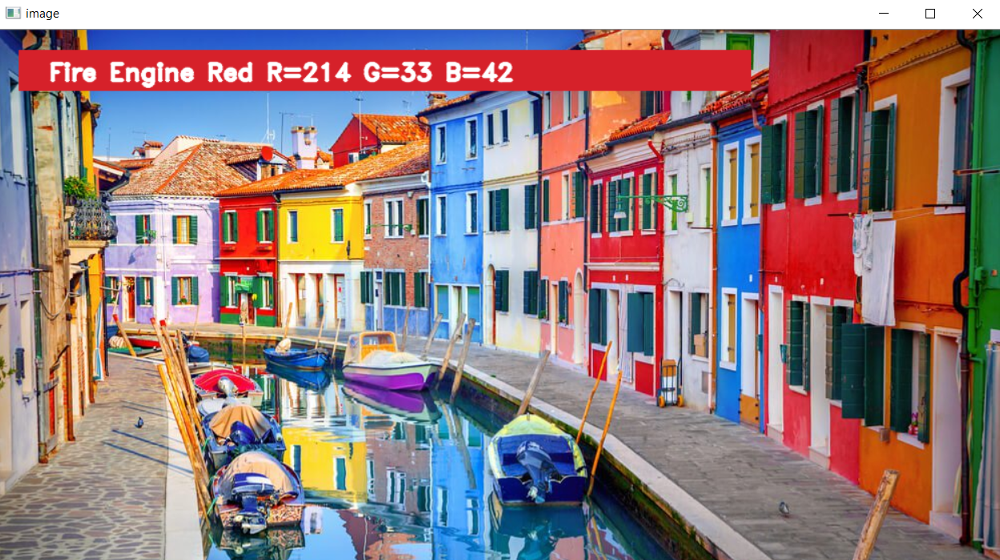
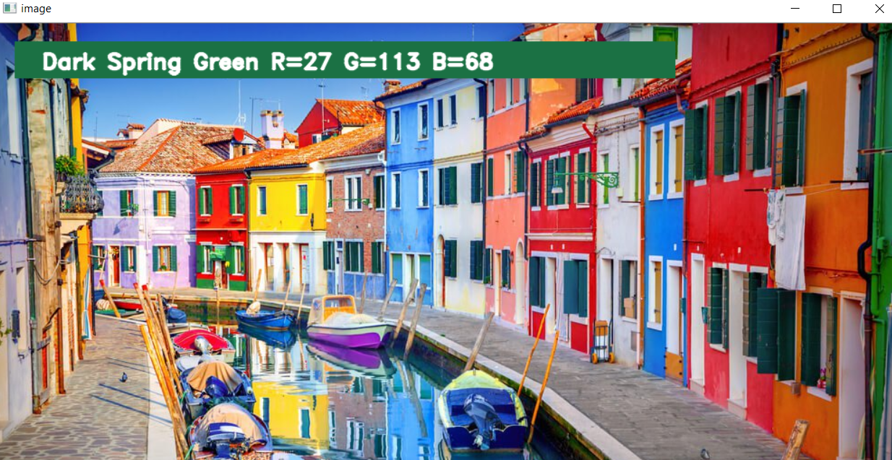

# **Color Detection** 

---

**Color Detection**

In this project my goal is to build a Color detection program, color detection is necessary to recognize objects, it is also used as a tool in various image editing and drawing apps.

---
### Dependencies
The only special libraries used in this project are: opencv,  pandas and numpy.

You can install the dependencies like this:
```
    pip install opencv-python
    pip install pandas
    pip install numpy
```
### To run the project

After running the program double click anywhere in the image.
```
    python color_detection.py -i <add your image path here>
```

## Output






