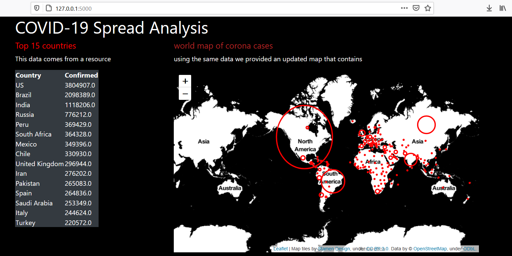

# **COVID-19 Spread Analysis** 

---

**COVID-19 Spread Analysis**

In this project my goal was to implement a live dashboard for COVID 19 spread analysis. This dashboard will provide many insightful visualizations for the study of coronavirus spread.

---
### Dependencies
The only special libraries used in this project are: Flask, Pandas and folium.

You can install the dependencies like this:
```
	pip install flask
	pip install pandas
	pip install folium
```
### To run the project
For Linux:
```
	export FLASK_APP=app.py
	flask run
```
For Windows:
```
	set FLASK_APP=app.py
	flask run
```

### Dataset
The dataset consists of corona spread data from different countries and different cities. This dataset also contains the latitude and longitude of corona affected areas. We will filter and visualize the countries and the cites within countries with maximum corona cases.

#### Output

