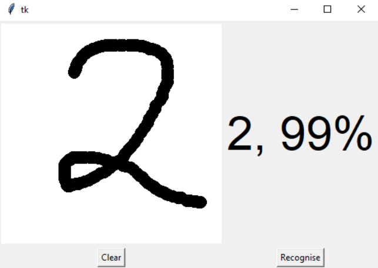
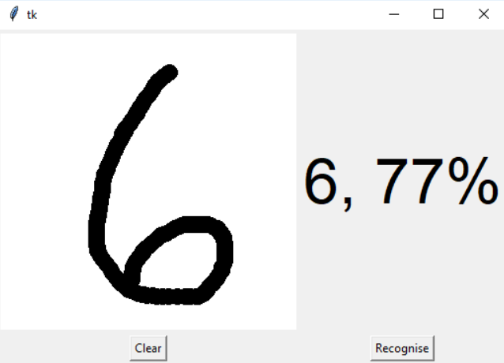

# **Handwritten Digit Recognition** 

---

**Handwritten Digit Recognition**

In this project my goal is to build a pipe line to classified hand written numbers using deep learning.

---
### Dependencies
The only special libraries used in this project are: numpy, keras, tensorflow, pillow and pywin32.

You can install the dependencies like this:
```
    pip install numpy
    pip install keras
    pip install tensorflow
    pip install pillow
    pip install pywin32
```

---
### Dataset
For this project we will use a dataset called mnist. The MNIST database of handwritten digits, available from this page, has a training set of 60,000 examples, and a test set of 10,000 examples. It is a subset of a larger set available from NIST. The digits have been size-normalized and centered in a fixed-size image. 


A sample of this dataset is included with the accompanying git repo and the full dataset can be downloaded from [here](http://yann.lecun.com/exdb/mnist/).

### Predicting a digit

We first need to train our model and then run the gui.

```
    python train_digit_recognizer.py
    python gui_digit_recognizer.py
```

## Images






