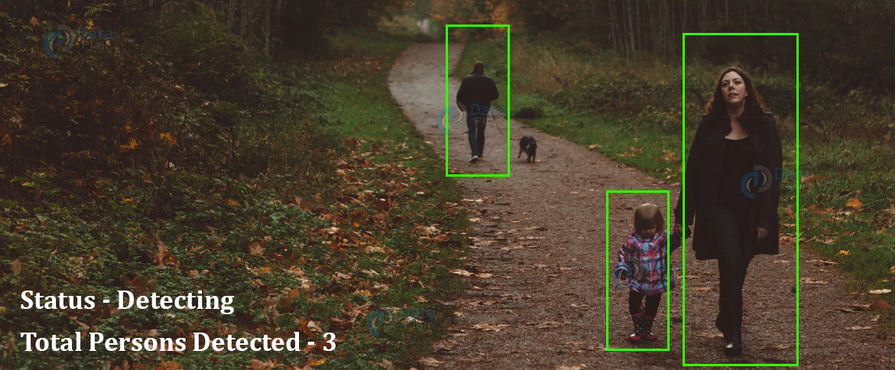
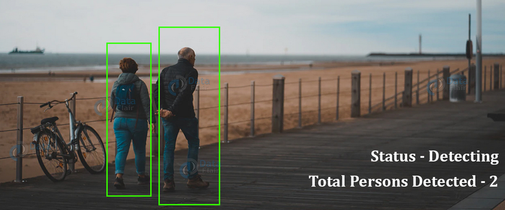

# **Real-time Human Detection & Counting** 

---

**Real-time Human Detection & Counting**

In this project my goal is to build a Human Detection and Counting System through Webcam, recorded video or images.

---
### Dependencies
The only special libraries used in this project are: opencv,  imutils and numpy.

You can install the dependencies like this:
```
    pip install opencv-python
    pip install imutils
    pip install numpy
```
### To run the project

```
    python main.py -v ‘Path_to_video’
    python main.py -i ‘Path_to-image’
    python main.py -c true
```

## Output






