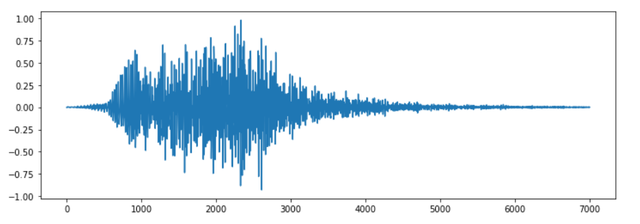
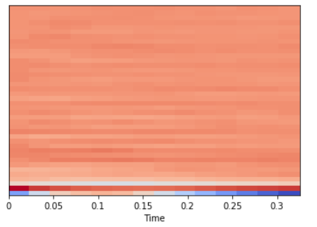

# **Sound Classification using Deep Learning** 

---

**Sound Classification using Deep Learning**

In this project my goal is to build a pipe line to classified sounds using deep learning.

---
### Dependencies
The only special libraries used in this project are: pandas and librosa.

You can install the dependencies like this:
```
    pip install pandas
    pip install librosa
```

---
### Dataset
For this we will use a dataset called Urbansound8K. The dataset contains 8732 sound excerpts (<=4s) of urban sounds from 10 classes, which are:

- Air Conditioner
- Car Horn
- Children Playing
- Dog bark
- Drilling
- Engine Idling
- Gun Shot
- Jackhammer
- Siren
- Street Music

A sample of this dataset is included with the accompanying git repo and the full dataset can be downloaded from [here](https://urbansounddataset.weebly.com/urbansound8k.html).

### Predicting a sound

```
filename = 'audio/207124.wav'
print_prediction_mfcc(filename)

The predicted class is: dog_bark 

air_conditioner     :  0.00000000000000866614062005862176
car_horn            :  0.00000000608463057716335242730565
children_playing    :  0.00011100043775513768196105957031
dog_bark            :  0.99985098838806152343750000000000
drilling            :  0.00000005600201902211665583308786
engine_idling       :  0.00000001410392069800536773982458
gun_shot            :  0.00000007226645948321674950420856
jackhammer          :  0.00000000000059686955898585747349
siren               :  0.00003795461816480383276939392090
street_music        :  0.00000000000929918208408819779720

```

## Images






